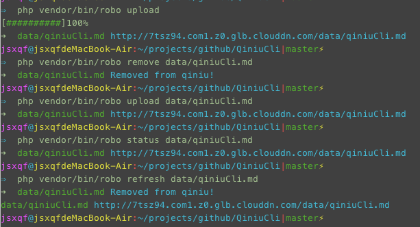

##QiniuCli
>speed up your development

Have fun with qiniu cdn.

###Dependence

[Robo](http://robo.li/started.html)

[sweetCli](https://xuqingfeng.github.io/doc/sweetCli/)
>my another project ;)

[qiniu-php](https://github.com/qiniu/php-sdk/tags)

####Install Dependence
>via composer

```javascript
{
    "require": {
        "codegyre/robo": "*",
        "sweet/cli": "0.1.*"
    }
}
```

###Features

- upload

- remove

- status

- refresh



###How

Fill out your config file.

```bash
mv config.example.php config.php
```

```php
php vendor/bin/robo upload ($param)

php vendor/bin/robo remove $param

php vendor/bin/robo remove:all

php vendor/bin/robo status ($param)

php vendor/bin/robo refresh $param
```

###License

GPLv3


